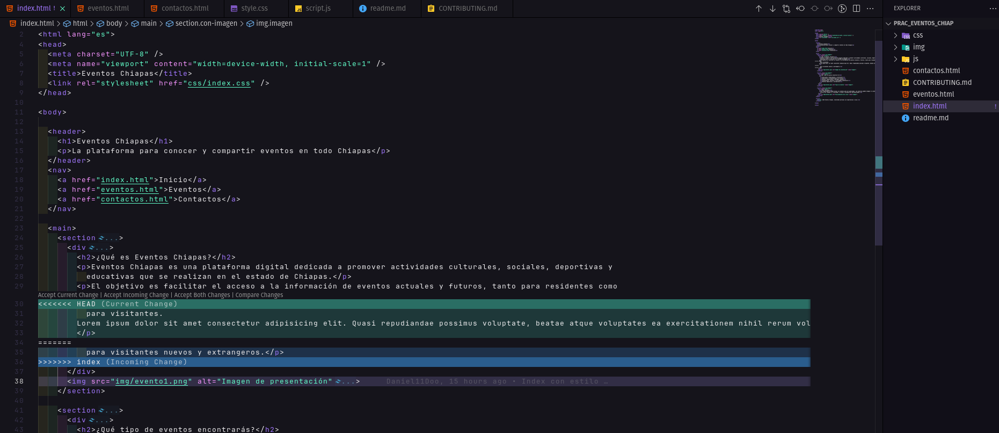
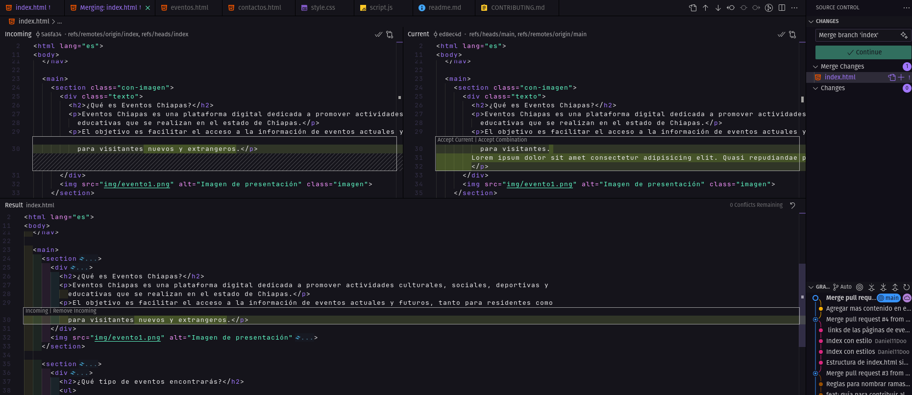
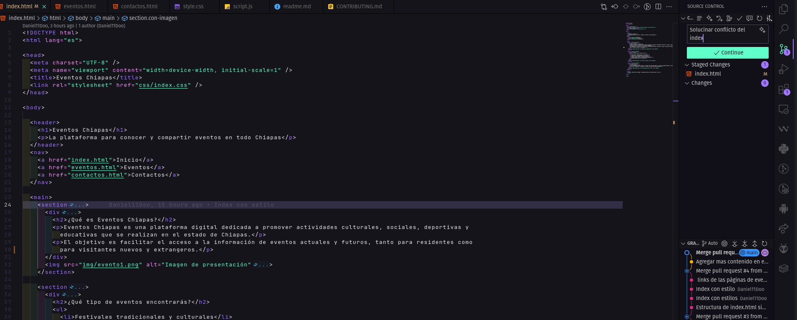
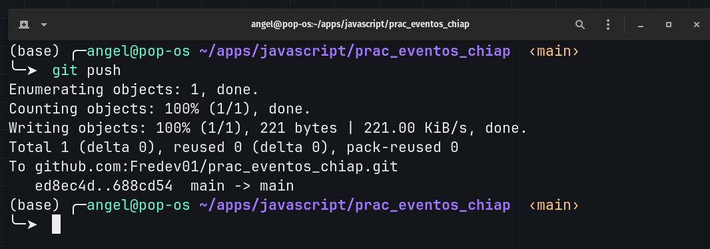

# Solución del conflicto

## En VSCode aparecen los cambios realizados en la misma línea de código. En este caso, se aceptaron los cambios entrantes.

  

## Una vez aceptados los cambios, lo siguiente es realizar un commit relacionado con el conflicto.

## Por último, realiza un push al repositorio remoto.

